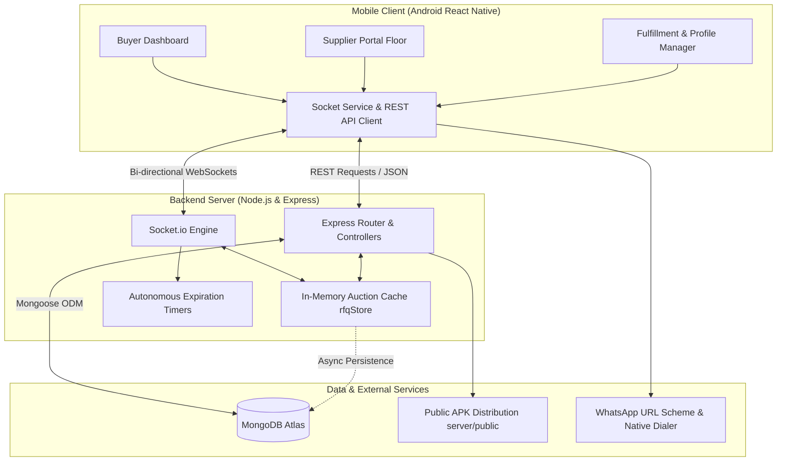
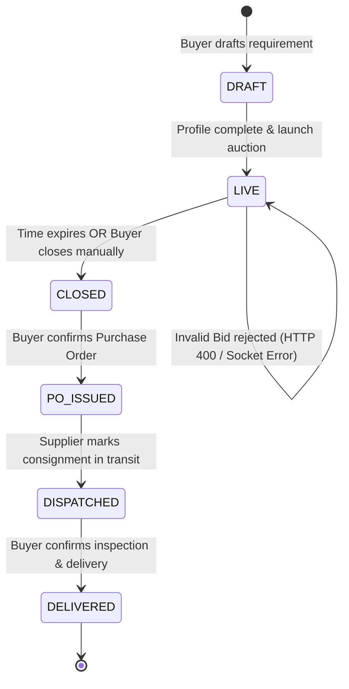

# SwiftRFQ — B2B Reverse Auction Platform for Commodity Procurement

[-3DDC84.svg?style=flat&logo=android)](https://reactnative.dev/)
[](https://nodejs.org/)
[](https://www.mongodb.com/)
[](https://socket.io/)
[](LICENSE)

> **SwiftRFQ** replaces informal, chaotic WhatsApp procurement groups with a real-time, rule-governed reverse auction platform designed specifically for bulk B2B commodity procurement (chemicals, raw materials, agricultural commodities, industrial supplies).

---

## 📱 Quick Links & Live Deployments

- **Live Production Backend**: [`https://swiftrfq-android-application-for-reverse.onrender.com`](https://swiftrfq-android-application-for-reverse.onrender.com)
- **Single-Click APK Download**: [`https://swiftrfq-android-application-for-reverse.onrender.com/download`](https://swiftrfq-android-application-for-reverse.onrender.com/download)
- **Health Check Endpoint**: [`https://swiftrfq-android-application-for-reverse.onrender.com/health`](https://swiftrfq-android-application-for-reverse.onrender.com/health)

---

## 🎯 The Problem

In industrial commodity markets (e.g., bulk Hydrogen Peroxide $H_2O_2$, Caustic Soda, grain, or steel coils), procurement commonly runs on informal WhatsApp groups:
1. **Chaos & Human Error**: The buyer creates a group with 10–20 suppliers and pastes the requirement. Bids pour in unstructured chat messages.
2. **Missing Competitive Tension**: Suppliers quote once or withhold aggressive pricing because chat rooms lack dynamic visibility into floor asks.
3. **No Auditability or Validation**: Buyers struggle to identify who quoted first, whether minimum decrements were respected, and whether unverified participants met specifications.
4. **Post-Award Friction**: Once a supplier wins, moving from the chat quote to a formal Purchase Order (PO) and dispatch tracking requires manual calls and spreadsheets.

**SwiftRFQ automates this entire lifecycle** into a streamlined mobile and real-time backend engine.

---

## 🚀 Key Features

### 1. Reverse Auction Creation & Management (Buyer)
- **Structured RFQ Creation**: Buyers specify Commodity, Specification / Grade, Quantity, Unit (`L`, `kg`, `MT`, `Ton`, `Units`), Delivery Terms, Duration, Starting Ceiling Price, and Minimum Decrement step.
- **Hidden Reserve Price**: Buyers can set a confidential reserve price. The system automatically tags whether the winning bid met or breached the target reserve.
- **Private Supplier Invitation & WhatsApp Integration**: Invite specific suppliers from the buyer's private directory or phone contacts. Sends pre-composed WhatsApp invites containing a single-click direct APK download link and auction room credentials.

### 2. Live Bidding Floor (Supplier)
- **Real-Time Order Book & Standing**: Dynamic leaderboard powered by Socket.io with millisecond latency.
- **Floor Guardrails**: Enforces the minimum decrement step ($\Delta_{\min}$). A supplier cannot submit a bid unless it is strictly $\le (\text{Current Lowest} - \Delta_{\min})$.
- **Bidder Anonymity on Floor**: Competitors see verified rankings without exposing supplier identities to prevent collusion.
- **Real-Time Visual Countdown**: Dynamic timer with color-coded urgency states.

### 3. Strict Profile Completeness Gating
- Neither party can trade anonymously or without accountability.
- **Buyer Guard**: A buyer cannot launch an auction without:
  - Full Legal Name
  - Registered Company / Enterprise Name
  - 10-Digit Verified Phone Number
  - Facility / City Location
- **Supplier Guard**: A supplier cannot submit bids on the floor until all 4 profile fields are completed.
- One-tap resolution prompts navigate directly to the Profile Editor.

### 4. Autonomous Closing Logic & Winner Declaration
- **Server-Side Autonomous Expiration**: An autonomous timer runs independently on the Node.js server. If the countdown reaches zero, the auction closes immediately, even if all clients are disconnected.
- **Instant Result Calculation**: Final standings are computed, the winner is determined (lowest qualifying ask), and savings percentages against the ceiling price are calculated.
- **Direct Winner Communication**: One-tap buttons to initiate direct phone calls or open WhatsApp with pre-populated PO confirmation messages.

### 5. 4-Stage Post-Auction Order Fulfillment Tracker
Accessible anytime by both the Buyer and the winning Supplier:
$$\text{AWARDED (Deal Closed)} \longrightarrow \text{PO ISSUED (Contract Formed)} \longrightarrow \text{DISPATCHED (In Transit)} \longrightarrow \text{DELIVERED (Fulfilled \& Inspected)}$$
- **PO Tracking Number**: Formatted reference (e.g., `PO-1001`).
- **Full Spec Card**: Quantity, settlement unit rate, total contract value, delivery consignee facility, and commercial payment terms.
- **Interactive State Progression**: Role-gated transitions allowing buyers to issue POs, suppliers to confirm dispatch, and buyers to verify delivery.

---

## 🏗️ Architecture & Technology Stack



### Stack Breakdown & Rationale

| Layer | Technology | Rationale |
| :--- | :--- | :--- |
| **Mobile App** | React Native (Expo SDK 52) | Cross-platform codebase compiled to high-performance native Android. Fast iteration, custom dark-gold design token system (`darkPalette`), and native hardware access (Dialer, WhatsApp intents). |
| **Backend Engine** | Node.js + Express | Event-driven, non-blocking I/O ideal for concurrent WebSocket connections and bid ingestion. |
| **Real-Time Transport**| Socket.io | Bi-directional low-latency communication with built-in room clustering (`room-RFQ-XXXX`), automatic reconnection, and socket fallback. |
| **State Management** | In-Memory `rfqStore` + MongoDB Atlas | Dual-layer persistence: In-memory memory store delivers $< 5\text{ms}$ bid processing and conflict-free lowest ask calculations, while MongoDB Atlas provides durable storage for audit histories, users, and RFQs. |
| **Styling & Theme** | Industrial Luxury Palette | Custom tokenized color system with warm brass accents, dark slate surfaces, and olive status indicators tailored for B2B procurement professionals. |

---

## 📐 Reverse Auction Rules & State Machine



### Mathematical Invariants
1. **Floor Ask Decrement**:
   $$P_{\text{new}} \le P_{\text{lowest}} - \Delta_{\min}$$
2. **Ceiling Invariant**:
   $$P_{\text{first}} \le P_{\text{ceiling}}$$
3. **Tie-Break Rule**:
   If $P_A = P_B$, the bid received with timestamp $T_A < T_B$ retains priority. Subsequent equal bids are rejected by the decrement invariant.
4. **Reserve Threshold**:
   $$\text{metReserve} = \begin{cases} \text{true}, & \text{if } P_{\text{winning}} \le P_{\text{reserve}} \\ \text{false}, & \text{otherwise} \end{cases}$$

---

## 📁 Repository Structure

```
SwiftRFQ/
├── mobile/                               # React Native (Expo) Android App
│   ├── android/                          # Native Android Project (Gradle, CMake, C++)
│   ├── assets/                           # Branding assets, icons, splash
│   ├── src/
│   │   ├── screens/
│   │   │   ├── SplashScreen.js           # Auth entry, Google OAuth, session restore
│   │   │   ├── BuyerDashboardScreen.js   # Buyer RFQ overview & stats
│   │   │   ├── CreateRfqScreen.js        # New reverse auction configuration
│   │   │   ├── LiveAuctionRoomScreen.js  # Live floor for buyers & suppliers
│   │   │   ├── SupplierPortalScreen.js   # Supplier floor, won bids & bids history
│   │   │   ├── AuctionClosedScreen.js    # Concluded standings & fulfillment tracker
│   │   │   ├── ProfileScreen.js          # User & company profile editor
│   │   │   └── SettingsScreen.js         # Preferences, theme toggling, logout
│   │   ├── services/
│   │   │   ├── api.js                    # REST API client with dynamic IP detection
│   │   │   ├── socket.js                 # Socket.io connection manager
│   │   │   ├── profileValidation.js      # Strict profile completeness validator
│   │   │   └── customAlert.js            # Unified modal alert service
│   │   └── theme/tokens.js               # Industrial design system tokens
│   ├── App.js                            # Screen navigator & global socket listener
│   └── package.json
│
├── server/                               # Node.js Express Backend
│   ├── config/db.js                      # MongoDB Atlas connection manager
│   ├── controllers/
│   │   ├── authController.js             # User registration, login, profile updates
│   │   ├── biddingController.js          # RFQ CRUD, bid submission, fulfillment
│   │   └── contactController.js          # Buyer private supplier network directory
│   ├── models/
│   │   ├── User.js                       # Mongoose User schema (phone, company, role)
│   │   ├── RFQ.js                        # Mongoose RFQ & fulfillment schema
│   │   ├── Bidding.js                    # Mongoose individual bid record schema
│   │   └── rfqStore.js                   # High-throughput in-memory auction engine
│   ├── public/
│   │   └── SwiftRFQ.apk                  # Direct downloadable release APK
│   ├── routers/                          # REST route definitions
│   ├── socket/auctionHandler.js          # Real-time WebSocket auction lifecycle
│   ├── server.js                         # Application entrypoint & HTTP server
│   └── package.json
│
└── README.md
```

---

## 🛠️ Getting Started (Local Development)

### Prerequisites
- **Node.js**: v18.0.0 or higher
- **npm** or **yarn**
- **Android Studio** with Android SDK platform 34/36 & build-tools
- **Java Development Kit (JDK)**: JDK 17 (Zulu or OpenJDK)
- **Physical Android Device** (with USB debugging enabled) or **Android Emulator**

---

### Step 1: Start the Backend Server

```bash
cd server
npm install

# Setup environment variables (optional; defaults to local/test DB if omitted)
# PORT=5000
# MONGODB_URI=mongodb+srv://...

npm start
```
*The server will start on `http://localhost:5000` with WebSocket listeners active.*

---

### Step 2: Run the Mobile Application

```bash
cd mobile
npm install

# Run on connected Android device / emulator
npx expo run:android
```

---

### Step 3: Compiling Release APK

To compile an optimized release APK:

```powershell
# Using the Windows MAX_PATH safe build command:
subst S: "D:\Project\SwiftRFQ"
cmd.exe /c "pushd S:\mobile\android && gradlew.bat assembleRelease && popd"
subst S: /D

# Output APK location:
# mobile/android/app/build/outputs/apk/release/app-release.apk
```

To install directly to a connected USB device:
```bash
adb install -r mobile/android/app/build/outputs/apk/release/app-release.apk
```

---

## 🌐 API Reference

### REST Endpoints

| Method | Endpoint | Description |
| :--- | :--- | :--- |
| `GET` | `/health` | Server health check and socket status |
| `POST` | `/api/auth/login` | User authentication & JWT issuance |
| `POST` | `/api/auth/register` | New buyer / supplier account creation |
| `PATCH` | `/api/auth/profile/:id` | Update profile (company name, phone, city) |
| `GET` | `/api/rfqs` | Fetch active or filtered reverse auctions |
| `POST` | `/api/rfqs` | Create and launch a new RFQ (Gated by profile check) |
| `POST` | `/api/rfqs/:id/close`| Manually conclude an RFQ and award lowest bidder |
| `PATCH` | `/api/rfqs/:id/fulfillment` | Advance fulfillment stage (`AWARDED` $\rightarrow$ `DELIVERED`) |
| `POST` | `/api/bids` | Submit a floor bid via HTTP fallback |
| `GET` | `/download` | Single-click APK download endpoint |

### WebSocket Events (Socket.io)

| Event Name | Direction | Payload | Description |
| :--- | :--- | :--- | :--- |
| `join_room` | Client $\rightarrow$ Server | `{ rfqId }` | Subscribe to live floor updates for an auction |
| `place_bid` | Client $\rightarrow$ Server | `{ rfqId, supplierId, amount }` | Submit a competitive floor ask |
| `lowest_bid_update`| Server $\rightarrow$ Client | `{ lowestBid, winningSupplier }` | Broadcast new lowest floor ask |
| `bid_placed` | Server $\rightarrow$ Client | `{ bid, standings }` | Real-time standings update |
| `auction_closed` | Server $\rightarrow$ Client | `{ winner, totalSavings }` | Broadcast final auction resolution |
| `fulfillment_update` | Server $\rightarrow$ Client | `{ rfqId, status }` | Live synchronization of order fulfillment |

---

## 📄 Architectural Note & Design Decisions

### Assumptions Made
1. **Connectivity Reliability**: Commodities trading happens in real-time, but users in industrial facilities may encounter brief packet loss. The app uses Socket.io with exponential backoff and transparent REST fallback so bids are never lost.
2. **Identity Verification**: In bulk B2B procurement, anonymous bidding leads to non-fulfillment. Hence, while bids appear anonymous to competitors on the floor, all participants must register valid enterprise credentials and phone numbers before participating.
3. **Closing Determinism**: In reverse auctions, bidders often wait until the last 30 seconds ("sniping"). Autonomous server-side timers ensure fair closing without relying on client device clocks.

### Trade-offs & Engineering Decisions
- **In-Memory Cache vs. Pure Database**:
  - *Trade-off*: Pure MongoDB writes on every bid introduce database I/O latency under heavy bidding.
  - *Decision*: Adopted an in-memory `rfqStore` for instant validation and socket broadcasting, paired with asynchronous MongoDB persistence.
- **Single-Click APK Distribution vs. App Store**:
  - *Trade-off*: Publishing to Google Play requires multi-day review cycles.
  - *Decision*: Built a self-hosted `/download` endpoint with direct WhatsApp sharing, enabling buyers to invite suppliers who can install the production build in under 60 seconds.

### What We'd Build Next
1. **Anti-Sniping Dynamic Timer Extension ("Soft Close")**: Automatically extend the auction by 60 seconds if a valid bid is placed in the final 30 seconds.
2. **Multi-Currency & Tax Engine**: Automatic GST / VAT computation and multi-currency conversion for cross-border commodities.
3. **Escrow & Digital Contract Signing**: Integration with digital signature APIs (e.g., DocuSign / Aadhaar eSign) upon winner declaration.
4. **Offline Sync & SMS Fallback**: Allow suppliers in low-connectivity industrial zones to bid via verified SMS gateway.

---

## 🤖 AI Pair Programming Transparency

This project was built through interactive pair programming with **Google Antigravity (Advanced Agentic AI)**.
- **Workflow**: Collaborative architectural planning, rapid full-stack prototyping, native Android Gradle CMake configuration, real-time WebSocket debugging, and rigorous device-level validation via ADB.

---

## 📜 License

This project is licensed under the MIT License — see the [LICENSE](LICENSE) file for details.
